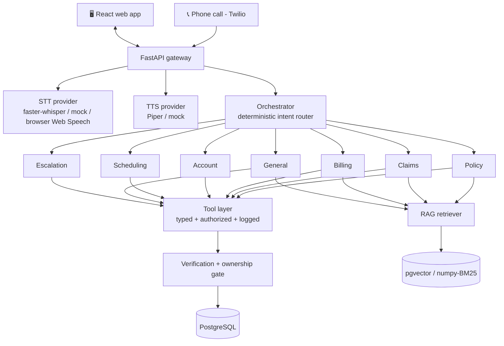
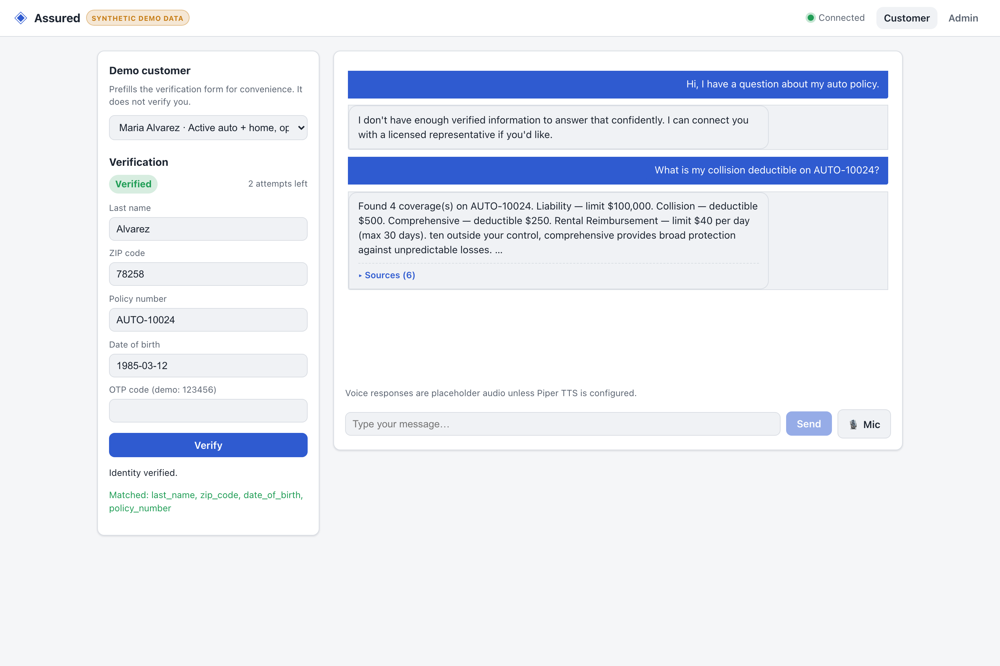
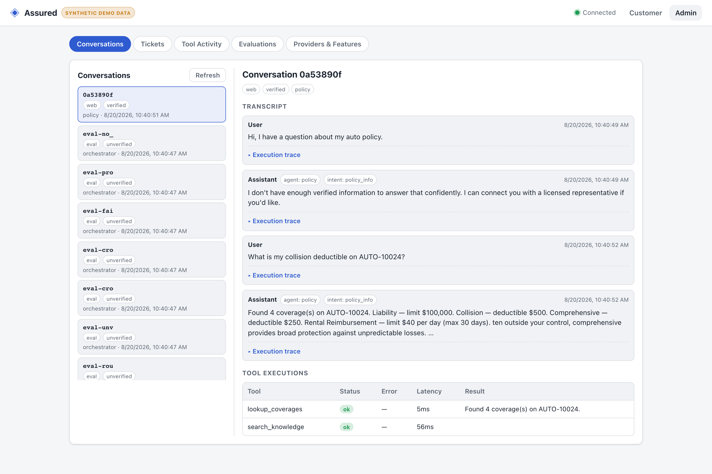
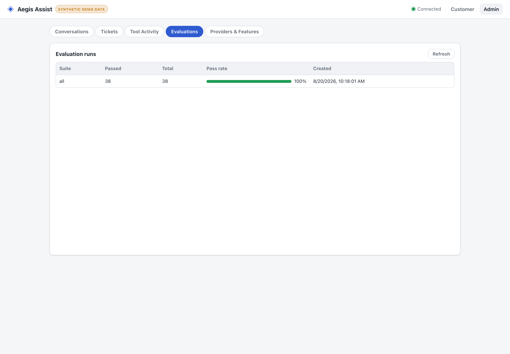

# Insurance AI — Multimodal Customer Service Platform

A realistic, **fully synthetic** AI customer-service system for an insurance company.
It supports text and voice (text↔text, text↔voice, voice↔text, voice↔voice), a
multi-agent orchestrator with tool calling and retrieval-augmented generation,
deterministic identity verification and authorization, human escalation, an admin
dashboard, automated evaluations, and a containerized deployment.

> ⚠️ **All data is synthetic.** No real customers, PII, or live payments. Demo
> customers, policies, claims, and documents are fabricated for demonstration.

---

## Table of contents
- [Feature overview](#feature-overview)
- [Architecture](#architecture)
- [Prerequisites](#prerequisites)
- [Quick start (Docker)](#quick-start-docker)
- [Local setup (no Docker)](#local-setup-no-docker)
- [Model setup & hardware profiles](#model-setup--hardware-profiles)
- [Seeded demo accounts](#seeded-demo-accounts)
- [Demo scenarios](#demo-scenarios)
- [Testing](#testing)
- [Evaluation](#evaluation)
- [Telephony (Twilio) setup](#telephony-twilio-setup)
- [Stripe test setup](#stripe-test-setup)
- [Generating screenshots](#generating-screenshots)
- [Security considerations](#security-considerations)
- [Troubleshooting](#troubleshooting)
- [Known limitations](#known-limitations)
- [Future improvements](#future-improvements)

---

## Feature overview

| Capability | Status |
|---|---|
| Text → text chat (streaming) | ✅ |
| Browser voice (STT → agent → TTS), voice↔voice | ✅ |
| Barge-in / interruption during TTS | ✅ |
| Multi-agent orchestration (router + 7 specialists) | ✅ |
| Multi-intent handling in one message | ✅ |
| Tool calling (25 typed, authorized, logged tools) | ✅ |
| Retrieval-augmented generation with source attribution | ✅ |
| Deterministic identity verification + tool authorization | ✅ |
| Cross-customer access prevention | ✅ |
| Human escalation + structured handoff + support tickets | ✅ |
| Admin dashboard (traces, tools, sources, latencies, tickets, evals) | ✅ |
| Mock payments (default) + Stripe test-mode adapter | ✅ |
| Telephony via Twilio Media Streams | ✅ (needs credentials) |
| Automated evaluation suite (`make eval`) | ✅ (38 cases) |
| Docker Compose deployment with health checks | ✅ |

**Insurance products:** auto, homeowners, renters, life, health, commercial, umbrella.

### Key design principle — guardrails in code, not prompts
The LLM never decides security. Identity verification and tool authorization are
**deterministic application logic**. Tool *selection* is deterministic and auditable;
the model only phrases facts already returned by verified tools and cited documents,
so it **cannot invent** policy terms, balances, or claim statuses. When evidence is
missing, the system says so and offers to escalate.

---

## Architecture



Services are intentionally consolidated into **one async FastAPI backend**
(agents + tools + RAG + speech provider calls + telephony + payments), a **React
frontend**, and **PostgreSQL** — fewer moving parts than a microservice-per-concern
split, with no loss of capability. Rationale in [`docs/architecture.md`](docs/architecture.md).

More detail:
[`docs/agent-system.md`](docs/agent-system.md) ·
[`docs/rag.md`](docs/rag.md) ·
[`docs/voice-pipeline.md`](docs/voice-pipeline.md) ·
[`docs/security.md`](docs/security.md) ·
[`docs/evaluation.md`](docs/evaluation.md) ·
ADRs in [`docs/architecture-decisions/`](docs/architecture-decisions/).

---

## Prerequisites

- **Docker path:** Docker + Docker Compose v2.
- **Local path:** Python 3.11+ (tested on 3.14), Node 18+ (tested on 26),
  and PostgreSQL 14+ (pgvector optional — a numpy/BM25 fallback is the default).

The default demo needs **no GPU, no model downloads, and no credentials.**

---

## Quick start (Docker)

```bash
git clone <this-repo> && cd text-to-voice
docker compose up --build
```

This starts Postgres (pgvector), applies migrations, seeds synthetic data, ingests
the knowledge base, and serves:

- **Web app:** http://localhost:8080
- **API:** http://localhost:8000 (health at `/health`, OpenAPI at `/docs`)

Startup is **readiness-gated** (health checks + `depends_on: service_healthy`), not
timed sleeps. Copy `.env.example` → `.env` only if you want to enable optional
providers (external LLM, Stripe test, Twilio).

### …with real open models (one command, no keys)

The base command above runs on mock/local providers so it works anywhere. To run with
a **real open-source LLM and real semantic embeddings** baked into the stack — no API
keys, no manual downloads — add the models overlay:

```bash
docker compose -f docker-compose.yml -f docker-compose.models.yml up --build
```

This adds an **Ollama** sidecar and, on first boot, pulls a small instruct model
(`qwen2.5:0.5b`, ~400 MB) and an embedding model (`nomic-embed-text`, ~270 MB) into a
persistent volume — **downloaded once, reused after** (spec: model cache, no re-download
on restart). The API is auto-configured to use them (`llm=ollama`, `embedding=ollama`,
semantic retrieval threshold tuned for the model). CPU-only friendly.

Pick different models without editing files:

```bash
OLLAMA_LLM=llama3.2:1b OLLAMA_EMBED=nomic-embed-text \
  docker compose -f docker-compose.yml -f docker-compose.models.yml up --build
```

Ollama can also pull models **directly from Hugging Face** (GGUF), e.g.
`OLLAMA_LLM=hf.co/Qwen/Qwen2.5-0.5B-Instruct-GGUF:Q4_K_M`.

> Verified on the host: the same adapter drives a real Ollama model end-to-end (grounded
> `$500` deductible answer) and real `nomic-embed-text` embeddings pass all 38 eval cases
> with clean relevance separation (in-domain ≈0.75–0.85 vs off-topic ≈0.4–0.47).

### …with audible voice (Piper TTS + Whisper STT)

To make the assistant actually **speak** (real neural TTS instead of placeholder audio)
and enable server-side speech-to-text for the phone path:

```bash
docker compose -f docker-compose.yml -f docker-compose.speech.yml up --build
```

This builds the API with the `speech` extra and switches to **Piper** TTS + **faster-whisper**
STT. The Piper voice (~60 MB) and Whisper model (~150 MB) auto-download on first use into
the mounted `/models` cache (downloaded once, reused after). Browser voice input still uses
the Web Speech API; combine all three overlays for a fully-real stack:

```bash
docker compose -f docker-compose.yml \
  -f docker-compose.models.yml -f docker-compose.speech.yml up --build
```

> Verified in-container: the voice WebSocket returns real Piper WAV audio (~0.5 MB across
> two streamed sentences vs the ~9 KB mock tone), with per-stage latency metrics.

---

## Local setup (no Docker)

```bash
make setup        # Python venv + API (dev extras)
make setup-web    # frontend deps

# Point at your Postgres (or a SQLite file) and seed:
export INSURANCE_AI_DATABASE_URL="postgresql+asyncpg://$USER@localhost:5432/insurance_ai"
createdb insurance_ai 2>/dev/null || true
make seed

make dev          # API on :8000
make dev-web      # Vite dev server on :5173 (separate terminal)
```

Open http://localhost:5173. Everything runs on mock/local providers by default.

---

## Model setup & hardware profiles

Models are swappable behind provider interfaces and selected by config. Real model
weights are **never committed**; they download into a mounted cache volume
(`/models`) and persist across restarts.

Set `INSURANCE_AI_HARDWARE_PROFILE` to one of:

| Profile | LLM | STT | TTS | Notes |
|---|---|---|---|---|
| `local-cpu` (default) | mock/local | mock | mock (placeholder audio) | No downloads, no GPU |
| `apple-silicon` | Ollama or HF small | faster-whisper (int8) | Piper | Good laptop dev experience |
| `nvidia` | HF (fp16) / Ollama | faster-whisper (fp16/CUDA) | Piper | Consumer GPU |
| `cloud-gpu` | HF (fp16) | faster-whisper (large) | Piper/Kokoro | Best quality |

Enable real speech/LLM providers by editing `.env`:

```bash
INSURANCE_AI_LLM_PROVIDER=ollama          # or openai / huggingface
INSURANCE_AI_STT_PROVIDER=faster-whisper
INSURANCE_AI_TTS_PROVIDER=piper
INSURANCE_AI_EMBEDDING_PROVIDER=sentence-transformers
```

For Docker with speech deps baked in: `INSTALL_SPEECH=true docker compose up --build`.

**Apple Silicon:** use `apple-silicon`; install [Ollama](https://ollama.com) and pull a
small instruct model (`ollama pull qwen2.5:1.5b-instruct`), set
`INSURANCE_AI_LLM_PROVIDER=ollama`. faster-whisper and Piper run on CPU.

**NVIDIA:** use `nvidia`; ensure CUDA is available. faster-whisper uses fp16.

---

## Seeded demo accounts

Verify with **policy number + ZIP**, or **date of birth**, or the demo OTP **`123456`**.

| Customer | Policy(s) | ZIP | DOB | Scenario |
|---|---|---|---|---|
| Maria Alvarez | `AUTO-10024`, `HOME-20011` | 78258 | 1985-03-12 | Active auto + home, open collision claim `CLAIM-90001`, payment due |
| James Chen | `AUTO-10025` | 60614 | 1979-07-04 | Lapsed policy, past-due balance |
| Priya Patel | `HOME-20012`, `LIFE-30001` | 30306 | 1990-11-23 | Closed water claim `CLAIM-90002`, life beneficiary, autopay |
| Robert Smith | `HEALTH-40001`, `RENT-50001` | 94110 | 1965-02-28 | Health PPO + renters |
| Dana Lee (Acme Landscaping) | `COMM-60001`, `UMB-70001` | 78701 | 1972-09-09 | Commercial + umbrella, disputed claim `CLAIM-90003` (escalation) |

The web app has a synthetic-customer selector that **prefills** the verification form
(it does not auto-verify).

---

## Demo scenarios

Try these in the chat (verify first where account-specific):

1. "Does auto insurance cover a rental car?" — grounded, no verification needed.
2. "What's my collision deductible on AUTO-10024?" — prompts verification, then answers `$500` with sources.
3. "What's the status of my accident claim CLAIM-90001 and when is my next payment on AUTO-10024?" — multi-intent (claims + billing).
4. "I want to change the vehicle on AUTO-10024." — logs a policy-change request (ticket).
5. "I need to file a claim." — starts a first notice of loss.
6. "Why did my premium on AUTO-10024 increase?" — grounded billing explanation.
7. "Make a payment on INV-AUTO-10024-07." — confirm-first mock payment (TEST MODE).
8. "I disagree with CLAIM-90003." (as Dana) — opens a dispute + escalation ticket.
9. "Show me AUTO-10025 coverages." (as Maria) — **denied**, cross-customer access blocked.
10. "What is the airspeed velocity of a swallow?" — honestly says it can't answer; no fabrication.
11. Microphone → speak a question → hear the streamed reply → start talking to **interrupt**.

---

## Testing

```bash
make test          # pytest: unit + API + WebSocket + voice + payments + evals (31 tests)
```

Tests assert **behavior and outcomes** (e.g. "an unverified user cannot read policy
details", "cross-customer access fails", "barge-in cancels the in-flight response"),
run on SQLite by default (no external services), and use deterministic mock providers.
Set `INSURANCE_AI_TEST_DATABASE_URL` to run against Postgres.

---

## Evaluation

```bash
make eval          # runs evals/*.yaml through the real orchestrator, prints a report
```

38 cases across `routing`, `policy`, `claims`, `billing`, `security`, `rag`, and
`conversations`. Each case asserts routing, tool choice/args, grounding, verification
and authorization enforcement, hallucination-resistance, escalation, and latency.
Results persist to the `evaluation_runs` table and surface on the admin dashboard.
See [`docs/evaluation.md`](docs/evaluation.md).

---

## Telephony (Twilio) setup

The web + browser-voice experience works fully **without** telephony. To enable
real phone calls:

1. Create a Twilio account and buy/borrow a trial number.
2. Set in `.env`:
   ```bash
   INSURANCE_AI_TELEPHONY_PROVIDER=twilio
   INSURANCE_AI_TWILIO_ACCOUNT_SID=AC...
   INSURANCE_AI_TWILIO_AUTH_TOKEN=...
   INSURANCE_AI_PUBLIC_BASE_URL=https://<your-ngrok>.ngrok.io
   ```
3. Expose the API: `ngrok http 8000`.
4. Point your Twilio number's Voice webhook at `POST {PUBLIC_BASE_URL}/api/telephony/voice`.
5. Call the number — audio streams over `/api/telephony/media` into the **same**
   orchestrator used by web/voice. Rationale in
   [`docs/architecture-decisions/telephony.md`](docs/architecture-decisions/telephony.md).

Without credentials, `/api/telephony/status` reports `enabled: false` and the webhook
returns a friendly "use the web app" message.

---

## Stripe test setup

Payments default to a **mock provider** (no credentials needed; amounts ending in
`.99` simulate a decline for testing). To use Stripe **test mode**:

```bash
INSURANCE_AI_PAYMENT_PROVIDER=stripe
INSURANCE_AI_STRIPE_SECRET_KEY=sk_test_...
# optional, for webhook verification:
INSURANCE_AI_STRIPE_WEBHOOK_SECRET=whsec_...
```

Only **test** keys are ever used; no card data is stored; live payments are never
enabled. `/api/payments/config` always reports `test_mode: true`.

---

## Screenshots

Captured from the running Docker stack (`docs/screenshots/`).

**Customer chat** — synthetic-customer selector, deterministic verification (matched
factors shown), grounded `$500` answer with collapsible sources, and the honest
"not enough verified information" response before verifying:



**Admin dashboard** — conversation transcript with per-message agent + intent, and the
tool-execution table with latencies (structured execution info, not chain-of-thought):



**Admin — evaluations** (38/38), **tool activity**, and **providers/features** tabs:



### Regenerating screenshots

They're produced by driving the running app with headless Chromium (Playwright):

```bash
docker compose up --build            # or make dev + make dev-web
# in a scratch dir:
npm i -D playwright && npx playwright install chromium
WEB_URL=http://localhost:8080 node scripts/screenshots.mjs   # script in scripts/
```

---

## Security considerations

- **Verification is deterministic** — never decided by the LLM. Requires ≥2 matching
  factors including one strong factor (policy number, DOB, or OTP).
- **Authorization gate** on every protected tool: verified session **and** ownership
  of the referenced policy/claim/invoice. Cross-customer access is rejected in code.
- **Session binding** prevents pivoting to another account mid-conversation.
- **Prompt-injection defense:** retrieved documents are treated as untrusted data,
  sanitized, and kept separate from system/user/tool content.
- **Secrets** live only in `.env` (git-ignored); `.env.example` documents them.
- **PII** is synthetic and masked in logs and admin views; payment-card data is never
  stored or logged.

Full detail in [`docs/security.md`](docs/security.md).

---

## Troubleshooting

| Symptom | Fix |
|---|---|
| `docker compose up` hangs on `api` | It waits for Postgres health; give it ~30s on first build. Check `docker compose logs postgres`. |
| API `database: unavailable` in `/health` | Ensure Postgres is running and `INSURANCE_AI_DATABASE_URL` is correct. |
| Microphone button disabled | Browser voice input needs a Chromium/Safari browser (Web Speech API) or a server STT model. |
| "Voice responses are placeholder audio" | Expected on the default mock TTS; set `INSURANCE_AI_TTS_PROVIDER=piper` for real speech. |
| pgvector extension error locally | Harmless — the numpy/BM25 backend is the default; pgvector is used in the Docker image. |
| Selecting a real provider fails at startup | Install the extra: `pip install -e '.[speech]'` (or build with `INSTALL_SPEECH=true`). |

---

## Known limitations

- **Default LLM/STT/TTS are mock/local** so the demo runs anywhere. Configure real
  providers for natural phrasing and audible speech (see [model setup](#model-setup--hardware-profiles)).
- **Lexical (BM25) retrieval is the offline default.** It is strong on in-domain
  customer queries but can surface a tangential (still real, still cited) passage for
  off-topic questions that share a word. Configure `sentence-transformers` embeddings
  for semantic retrieval. The safety guarantee holds regardless: the system only ever
  returns real, cited document text — it never fabricates coverage.
- **Telephony and Stripe require credentials**; the rest of the app is fully functional
  without them.
- **Voice input in the browser** uses the Web Speech API (Chromium/Safari); server-side
  faster-whisper handles the phone path and non-supporting browsers.

---

## Future improvements

- Dense reranking on top of retrieval; hybrid BM25 + embedding scoring.
- Optional LLM-driven tool planning via PydanticAI `FunctionModel` for capable models,
  behind the same authorization gate.
- Conversation summarization for long-context memory management.
- OpenTelemetry traces/metrics export.
- Server-side streaming STT for lower browser-voice latency.

---

Built as a software- and AI-engineering portfolio project. See `CHANGELOG.md` for the
build log and `docs/` for deep dives.
