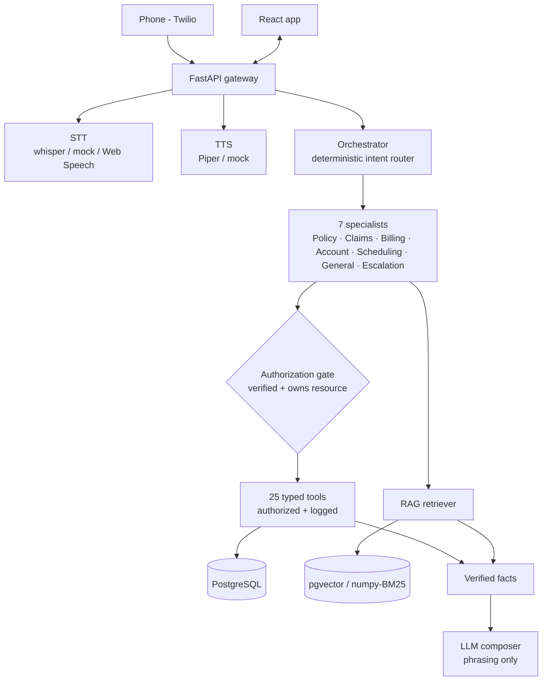

# Assured — Multimodal Insurance AI

[](https://github.com/John-Jepsen/assured/actions/workflows/ci.yml)
[](LICENSE)

One assistant orchestrating four model types — **LLM · STT · TTS · embeddings** — for
insurance customer service over text and voice (including phone). It answers only what
it can verify. **Fully synthetic:** no real customers, PII, or live payments.

---

## The idea: guardrails in code, not prompts

The LLM never decides who you are or what you may access. Identity verification and
per-tool authorization are **deterministic application logic**. The model only phrases
facts that verified tools and cited documents already returned — so it cannot invent a
balance, a coverage term, or a claim status. Missing evidence yields an honest "I can't
confirm that" and an offer to escalate, never a guess.

For a regulated domain that buys three things:

- **Auditability** — every turn emits a structured trace: intent → tools (args + results) → cited sources → per-stage latencies. Not chain-of-thought — an operational record.
- **Safety** — cross-customer access is rejected in code; retrieved documents are treated as untrusted and sanitized against prompt injection; a session is bound to one customer.
- **Reproducibility** — the same input yields the same routing and tool plan, and it's covered by a behavioral eval suite.

---

## Architecture



One async **FastAPI** backend (agents, tools, RAG, speech, telephony, payments), a
**React** frontend, and **PostgreSQL** (pgvector, with a numpy/BM25 fallback) —
deliberately consolidated: fewer moving parts than a service-per-concern split, same
capability. ~6.8k lines of Python.

### Engineering decisions

| Decision | Rationale |
|---|---|
| Deterministic intent router + tool planner (not an LLM agent loop) | Auditable, reproducible, safe by construction — the LLM only phrases |
| Verification + ownership gate on **every** protected tool | Security cannot be prompt-injected away |
| Model providers swappable behind interfaces; mock defaults | Runs anywhere with zero downloads; drop in Ollama/OpenAI/Whisper/Piper/sentence-transformers via config |
| RAG returns only real, cited passages | Fabricated coverage is structurally impossible |
| One backend, health-gated startup | Simple to run and reason about; no sleep-timer races |

Deep dives: [`agent-system`](docs/agent-system.md) · [`security`](docs/security.md) ·
[`rag`](docs/rag.md) · [`voice-pipeline`](docs/voice-pipeline.md) ·
[`evaluation`](docs/evaluation.md) · ADRs in [`docs/architecture-decisions/`](docs/architecture-decisions/).

---

## Capabilities

| | |
|---|---|
| **Channels** | Streaming text; browser voice (STT→agent→TTS) with barge-in; phone via Twilio Media Streams |
| **Reasoning** | Multi-agent router + 7 specialists; multi-intent per message; 25 typed, authorized, logged tools; RAG with source attribution |
| **Transactions** | Identity verification, claim filing (FNOL), policy-change requests, mock/Stripe-test payments (confirm-first), scheduling, human escalation with structured handoff |
| **Ops** | Admin dashboard (traces, tools, sources, latencies, tickets, evals); optional OpenTelemetry; Docker Compose with health checks |

Products: auto, homeowners, renters, life, health, commercial, umbrella.

---

## Run it

**Docker (nothing else required):**

```bash
docker compose up --build
# Web http://localhost:8080 · API http://localhost:8000 (/health, /docs)
```

Runs on deterministic mock/local providers — no GPU, downloads, or credentials. Startup
is readiness-gated (health checks + `depends_on`), not timed sleeps.

**With real open models (no API keys)** — adds an Ollama sidecar (LLM + embeddings,
cached once) and/or Piper TTS + Whisper STT:

```bash
docker compose -f docker-compose.yml -f docker-compose.models.yml -f docker-compose.speech.yml up --build
```

**Local (no Docker):**

```bash
make setup && make setup-web
export INSURANCE_AI_DATABASE_URL="postgresql+asyncpg://$USER@localhost:5432/insurance_ai"
createdb insurance_ai 2>/dev/null; make seed
make dev        # API :8000
make dev-web    # web :5173
```

Providers are config-selected (`.env`); see [model setup](#model-providers).

---

## Verify it

```bash
make test   # 42 tests: unit + API + WebSocket + voice + payments + evals (SQLite, mock providers)
make eval   # 38 eval cases through the real orchestrator; report persisted to the DB + admin UI
```

Tests assert **behavior**, not implementation: an unverified user cannot read policy
details, cross-customer access fails, barge-in cancels the in-flight response. Evals
(routing, policy, claims, billing, security, rag, conversations) check routing, tool
choice/args, grounding, authorization, hallucination-resistance, escalation, and latency.
CI runs lint + tests on SQLite, the full eval suite against Postgres/pgvector, and the
frontend build.

---

## Try it

Verify with **policy number + ZIP**, **date of birth**, or the demo OTP **`123456`**.
The web app prefills the form from a synthetic-customer picker (it does not auto-verify).

| Customer | Policies | ZIP · DOB | Scenario |
|---|---|---|---|
| Maria Alvarez | `AUTO-10024`, `HOME-20011` | 78258 · 1985-03-12 | Auto+home, open claim `CLAIM-90001`, payment due |
| James Chen | `AUTO-10025` | 60614 · 1979-07-04 | Lapsed policy, past-due balance |
| Priya Patel | `HOME-20012`, `LIFE-30001` | 30306 · 1990-11-23 | Closed water claim, life beneficiary, autopay |
| Robert Smith | `HEALTH-40001`, `RENT-50001` | 94110 · 1965-02-28 | Health PPO + renters |
| Dana Lee (Acme) | `COMM-60001`, `UMB-70001` | 78701 · 1972-09-09 | Commercial+umbrella, disputed claim (escalation) |

Representative prompts (verify first where account-specific):

- *"What's my collision deductible on AUTO-10024?"* → prompts to verify, then answers `$500` with sources
- *"Does my policy cover a rental car?"* → direct yes/no from your actual coverage schedule
- *"I need to file a claim."* → collects policy + loss + date (in one message or across turns) and files a first notice of loss
- *"Status of my claim and my next payment?"* → multi-intent (claims + billing) in one turn
- *"Show me AUTO-10025 coverages."* (as Maria) → **denied** — cross-customer access blocked
- *"What's the airspeed velocity of a swallow?"* → honestly declines; no fabrication

---

## Model providers

Selected by config; real weights are never committed (they cache to a `/models` volume,
downloaded once). Defaults are mock/local so the demo runs anywhere.

```bash
INSURANCE_AI_LLM_PROVIDER=ollama              # or openai / huggingface
INSURANCE_AI_EMBEDDING_PROVIDER=sentence-transformers
INSURANCE_AI_STT_PROVIDER=faster-whisper
INSURANCE_AI_TTS_PROVIDER=piper
```

Real adapters live behind pip extras (`pip install -e '.[speech]'`) or the Docker
overlays above. Hardware-profile guidance and semantic-retrieval tuning are in
[`docs/rag.md`](docs/rag.md) and the [models ADR](docs/architecture-decisions/models-and-speech.md).

**Optional integrations** — [Twilio telephony](docs/architecture-decisions/telephony.md),
Stripe test-mode payments, and reranking/OpenTelemetry are credential- or config-gated;
the app is fully functional without them.

---

## Security posture

- Verification is deterministic (never the LLM): ≥2 matching factors including one strong factor (policy number, DOB, or OTP).
- Authorization gate on every protected tool: verified session **and** ownership of the referenced record — cross-customer access rejected in code.
- Retrieved documents are untrusted, sanitized, and channel-separated from system/user/tool content.
- Secrets only in `.env` (git-ignored); synthetic PII masked in logs and admin views; card data never stored. Stripe is test-mode only.

Full detail in [`docs/security.md`](docs/security.md).

---

## License

[MIT](LICENSE). All bundled data is synthetic. See `CHANGELOG.md` for the build log and
`docs/` for deep dives.
