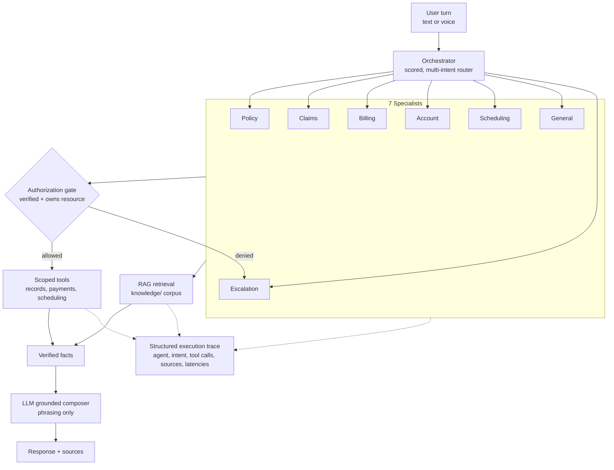

# Agent System

The agent system routes each customer request to a specialist, plans a set of authorized tool calls deterministically, executes them in application code, and lets the LLM phrase only already-verified facts. The result is auditable behavior: the model chooses wording, never policy data or permissions.

## Overview

- **Orchestrator** — a deterministic, rule-based intent router. It scores the incoming turn against intent signals, supports multi-intent turns, and dispatches to one or more specialists.
- **7 specialists** — Policy, Claims, Billing, Account, Scheduling, General, and Escalation. Each owns a scoped set of tools relevant to its domain.
- **Tools & RAG** — specialists call scoped tools (records, payments, scheduling) and a retrieval layer over the `knowledge/` corpus.

Tool **selection** is deterministic and auditable. Tool **authorization** and **execution** run in application code — never delegated to the LLM. The LLM is a grounded composer: it turns verified facts into natural language and cannot invent policy data.

## Intent Routing (scored, multi-intent)

The orchestrator matches the user turn against intent signals and produces a score per candidate intent. When several intents clear threshold (for example, "I want to pay my bill and also file a claim"), it routes to multiple specialists rather than forcing a single winner. Routing is rule-based and reproducible: the same input yields the same routing decision, and every decision is recorded in the execution trace.

## Specialists and Scoped Tools

Each specialist is a PydanticAI agent with a narrow tool surface. Scoping tools per agent limits blast radius and keeps authorization decisions local to a domain.

| Specialist | Responsibility | Representative scoped tools |
|------------|----------------|-----------------------------|
| Policy | Coverage, products, policy status | policy lookup, coverage detail, RAG |
| Claims | Claim status, filing, updates | claim lookup, claim create/update |
| Billing | Balances, payments, autopay | balance lookup, payment (mock/Stripe test) |
| Account | Profile, identity, contact info | account lookup, contact update |
| Scheduling | Appointments, callbacks | availability, book/cancel |
| General | FAQs, definitions, how-to | RAG retrieval |
| Escalation | Handoff to a human | escalation ticket, transfer |

## Deterministic Tool Planning vs LLM Phrasing

The pipeline separates two concerns:

1. **Planning & execution (deterministic).** The specialist plans which tools to call based on the routed intent and turn content. Before any tool runs, an **authorization gate** checks that the session's customer is verified (>=2 factors, at least 1 strong) and owns the requested resource. Tools execute in application code and return structured facts.
2. **Phrasing (LLM).** The verified tool results and any retrieved sources are handed to the LLM, which composes a grounded reply. Because the model only rephrases facts it was given, it cannot fabricate coverage, balances, or claim status. When evidence is missing, the system answers honestly ("I don't have enough info") and offers escalation rather than inventing an answer.

## Execution Trace (structured, not chain-of-thought)

Every turn emits a structured execution trace for auditing and the admin view. It captures **what the system did**, not the model's private reasoning:

- Selected **agent(s)** and matched **intent(s)** with scores
- **Tool calls** with arguments and structured results
- **Sources** cited from RAG retrieval (for attribution)
- **Latencies** per stage (speech-end -> transcript, transcript -> first token, first token -> first audio, speech-end -> first audio)

The trace deliberately excludes chain-of-thought. It is an operational record of decisions and effects, suitable for audit and debugging.

## Conversation Memory

Two memory scopes are kept separate:

- **Short-term session memory** — the working context for the active session (recent turns, verified-identity state, session-bound customer). It drives the current exchange and is not the system of record.
- **Persisted transcript** — the durable record of the conversation, stored for history and review.

Keeping them separate means transient session state (and the identity binding that gates tool authorization) never leaks into the durable record, and the persisted transcript is not treated as live working memory.

## Trust Boundaries

Retrieved documents are **untrusted**: they are sanitized against prompt injection, and system, user, retrieved, and tool content are kept in separate channels. Combined with the session-bound customer and the authorization gate, this prevents cross-customer access and stops retrieved text from steering tool selection or authorization.

## Data Flow

