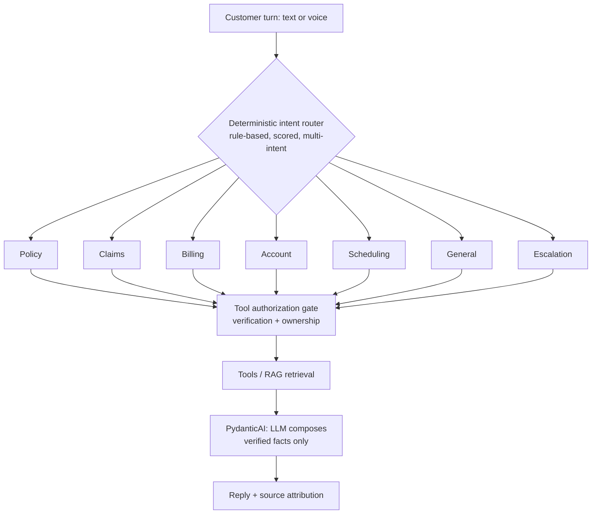

# ADR: Agent Framework — PydanticAI over LangGraph

- **Status:** Accepted
- **Date:** 2026-08-20
- **Context:** Multimodal AI insurance customer-service platform (synthetic demo)
- **Decision owners:** Platform / Agent team

## Context

The platform routes an incoming customer turn (text or voice) to one of
seven specialist agents — Policy, Claims, Billing, Account, Scheduling,
General, and Escalation — and each specialist may call authorized tools or
retrieve grounded knowledge (RAG) before composing a reply. We needed an
agent library that:

1. Produces **native structured outputs** and typed tool calls, so agent
   results map cleanly onto our domain models.
2. Is **model-agnostic**, matching our provider-interface design
   (LLMProvider, STT/TTS, embeddings chosen by config; MockLLM by default,
   OpenAI-compatible / Ollama / HF transformers as real adapters).
3. Makes the agent layer **deterministically testable**, since our security
   posture depends on tool *authorization* and execution living in
   application code — never in the model.
4. Keeps dependencies **lightweight** and avoids large amounts of custom
   framework glue for what is fundamentally a router-plus-specialists shape.

## Decision

Adopt **PydanticAI** as the agent framework.

Critically, the current build does **not** delegate orchestration to the
LLM. Routing is handled by a deterministic, rule-based, scored, multi-intent
router. Tool *selection* is deterministic and auditable; tool
*authorization* and execution are enforced in application code behind an
authorization gate (identity verification + session-bound ownership). The
LLM only phrases already-verified facts, so it cannot invent policy data.
PydanticAI sits at the **model-interface layer** (structured composition,
typed tool signatures) with an **optional LLM-driven planning layer** that
can be enabled without moving authorization into the model.

## Why PydanticAI

- **Native structured outputs & tool calling.** Pydantic-typed results and
  tool schemas remove hand-rolled parsing and keep the boundary between
  model output and domain code strict.
- **Model-agnostic.** Aligns with our provider interfaces; swapping MockLLM
  for an OpenAI-compatible endpoint, Ollama, or HF transformers is a config
  change, not a rewrite.
- **Deterministic testability.** `TestModel` and `FunctionModel` let us
  exercise agents without a live model, producing repeatable assertions over
  tool calls and outputs. This is decisive: our correctness and security
  guarantees rest on deterministic, auditable behavior.
- **Lightweight dependencies.** A smaller footprint than a graph runtime,
  which keeps the local-cpu hardware profile (mock/small defaults) fast and
  reproducible.
- **Less custom framework code.** For a router + specialists shape, we do not
  need graph construction, edge wiring, or state-channel plumbing.

## Why not LangGraph

- **Heavier graph abstraction.** LangGraph's value is explicit stateful
  graphs with cycles and checkpoints. Our orchestration is a deterministic
  router that fans out to independent specialists — a shape that does not
  benefit from graph modeling.
- **More custom code for our shape.** Expressing "score intents, pick
  specialists, enforce an authorization gate" as a graph would add
  boilerplate around logic we want to keep plain, auditable, and in
  application code.
- **More dependencies.** A larger runtime for capabilities we do not
  currently use.

## Tradeoffs

- We give up built-in orchestration primitives (durable state, cyclic
  control flow, checkpointing). We accept this because routing and
  authorization deliberately live in our own code, where they are easier to
  audit and test.
- PydanticAI is a younger ecosystem than LangGraph. We mitigate exposure by
  keeping model access behind our provider interfaces, so the framework is
  replaceable at a contained seam.
- The optional LLM-driven planning layer must never be allowed to authorize
  or execute tools; that invariant is enforced outside the model and covered
  by tests.

## What would change the decision

We would revisit and likely adopt a graph runtime such as LangGraph if the
product required:

- **Complex cyclic, stateful graphs** — multi-step reasoning loops with
  shared mutable state across many nodes.
- **Human-in-the-loop checkpoints** — pausing a run for agent/reviewer input
  and resuming from a persisted checkpoint.
- **Durable execution** — long-running or resumable workflows that must
  survive process restarts with persisted intermediate state.

None of these are required by the current router + specialists design, so
PydanticAI remains the better fit today.
