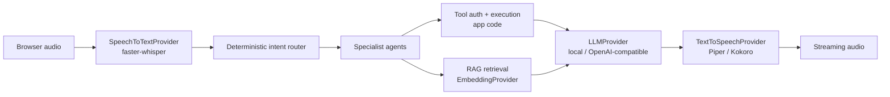

# ADR: Model + Speech Stack

**Status:** Accepted
**Context:** Multimodal AI insurance customer-service platform (synthetic demo)

## Context

The platform runs a voice + text agent pipeline: STT → intent router → specialist
agents → tools/RAG → LLM composition → TTS. Every model in that pipeline must be
swappable, runnable locally on commodity hardware for development and CI, and
upgradeable to higher-quality hosted or GPU-backed options without touching business
logic. This ADR records the default model and speech choices, the alternatives
considered, and the conditions under which we would revisit them.

## Decision

### Language model (LLM)

- **Default:** open-source / local. The out-of-the-box provider is a grounded
  `MockLLM` composer for deterministic tests and demos. The real local adapter runs
  small instruction-tuned open-weights models (e.g. Qwen-Instruct or Llama-Instruct)
  via an **Ollama** or **HF transformers** backend.
- **Optional:** any **OpenAI-compatible** endpoint, selected purely by config.

The LLM never selects tools or authorizes actions. Tool selection is a deterministic,
scored intent router; tool authorization and execution live in application code.
The model only phrases already-verified facts, so it cannot invent policy data.

### Speech-to-text (STT)

- **Decision:** **faster-whisper** (Whisper family). Default provider is `MockSTT`;
  the real adapter is faster-whisper.
- **Rationale:** strong open-source accuracy, streaming / near-streaming with partial
  transcripts (needed for low perceived latency and barge-in), runs on CPU and GPU,
  and configurable model size to trade accuracy for speed per hardware profile.

### Text-to-speech (TTS)

- **Decision:** **Piper** as the default real TTS (`MockTTS` emits a placeholder WAV
  tone). **Kokoro** optional for higher quality.
- **Rationale / tradeoffs:**
  - *Piper* — fast on CPU, permissive license, streams per sentence. Best fit for the
    local-cpu profile and the streaming pipeline. Quality is good, not top tier.
  - *Kokoro* — higher perceived quality; heavier, better suited to GPU profiles. Kept
    as an opt-in.
  - *XTTS* — expressive voice cloning, but heavier and with more restrictive licensing;
    not adopted by default.

### Embeddings

- **Default:** `HashEmbedding` — a deterministic lexical hashing vectorizer (dim 256).
  Zero downloads, reproducible retrieval, ideal for tests and demos.
- **Optional:** **sentence-transformers** (or OpenAI embeddings) for semantic quality
  when retrieval recall matters more than reproducibility. Stored as JSON float arrays,
  pgvector column in production.

## Hardware profiles

Model choices are keyed to a hardware profile; caches mount as volumes so restarts
never re-download.

| Profile        | LLM                   | STT / TTS               |
|----------------|-----------------------|-------------------------|
| local-cpu (default) | mock / small local | faster-whisper small, Piper |
| apple-silicon  | small local           | faster-whisper, Piper   |
| nvidia         | larger local          | larger Whisper, Kokoro  |
| cloud-gpu      | OpenAI-compatible / large | large Whisper, Kokoro |

## Why business logic is decoupled from any single model

Every model sits behind an interface — `LLMProvider`, `SpeechToTextProvider`,
`TextToSpeechProvider`, `EmbeddingProvider` — chosen by config. The orchestrator,
intent router, tool authorization gate, and RAG layer depend only on these interfaces.

Consequences:

- Swapping mock → local → hosted is a config change, not a code change.
- CI and local dev run fully offline with deterministic mocks; no keys required.
- The security model holds regardless of LLM: identity verification, session-bound
  customer scoping, tool authorization, and prompt-injection sanitization of untrusted
  retrieved documents are enforced in application code, never delegated to the model.

## What would change the decision

- **LLM:** consistent grounding or phrasing failures from small local models, or a
  latency/quality bar that only a larger hosted model meets, would push the default to
  an OpenAI-compatible endpoint (config only).
- **STT:** if partial-transcript latency or accuracy proves inadequate on target
  hardware, revisit Whisper size or a streaming-native alternative.
- **TTS:** if naturalness becomes a differentiator and GPU is available, promote Kokoro
  (or reconsider XTTS despite licensing) to default on GPU profiles.
- **Embeddings:** if lexical hashing hurts retrieval recall on real knowledge content,
  switch the default to sentence-transformers.

Because all four sit behind provider interfaces, each change is isolated to
configuration and an adapter — business logic and security guarantees are unaffected.
