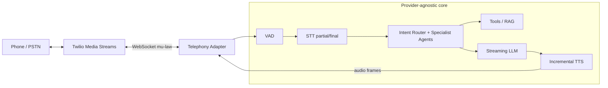

# ADR: Telephony Provider — Twilio Media Streams

**Status:** Accepted
**Context:** Real-time voice customer service over the phone (PSTN), alongside the existing web + browser-voice channels.

## Context

The platform runs a low-latency voice pipeline: audio → VAD → STT (partial/final) → orchestrator → specialist agent → tools/RAG → streaming LLM → incremental TTS → streaming audio, with barge-in support. To extend this to real phone calls we need a telephony provider that can deliver raw call audio to our backend in real time and play synthesized audio back, for both inbound and outbound calls.

Core requirements:

- Bidirectional, real-time media (not just recorded call files).
- Streaming interface compatible with our partial-transcript / incremental-TTS design.
- Low-friction local development (no data center, no carrier contract).
- Provider must be swappable — core agent logic stays provider-agnostic.

## Decision

Use **Twilio Media Streams**, which forks live call audio to our backend over a **WebSocket** as base64 μ-law frames and accepts synthesized audio frames back on the same socket. This maps cleanly onto our streaming pipeline: inbound frames feed VAD → STT; outbound TTS frames stream back per sentence.

Reasons:

- **Best-in-class docs and developer experience** — the fastest path to a working call.
- **Trial credits and a trial number** — no procurement to prove the demo.
- **WebSocket Media Streams** — real-time bidirectional audio that fits the partial/streaming model, including barge-in (inbound speech during playback stops TTS and reprocesses).
- **ngrok-friendly local dev** — Twilio calls a public webhook to start the stream; ngrok exposes the local FastAPI server, so a laptop handles real calls.
- **Inbound and outbound** — inbound via a webhook on the number; outbound via the REST API initiating a call that connects to the same stream.

## Architecture

The telephony provider is an adapter behind a boundary; the orchestrator and agents never import Twilio.

The adapter's only jobs are transport and codec: accept the Twilio WebSocket, decode inbound μ-law into the format the VAD/STT stage expects, and encode outbound TTS audio back into stream frames. Everything from VAD inward is identical to the web and browser-voice channels, so the same intent router, specialist agents, tool-authorization gate, and RAG apply unchanged. Per-stage latency (speech-end → transcript, transcript → first token, first token → first audio, speech-end → first audio) is tracked the same way and surfaced in admin.

## Alternatives considered

- **Vonage (Voice API / WebSockets).** Comparable capabilities and also supports WebSocket audio, but the docs, examples, and trial onboarding are less smooth for a demo build. Kept as a plausible second choice — because our provider boundary is thin, swapping to it later is a bounded change.
- **Raw SIP / Asterisk / FreeSWITCH.** Maximum control and no per-minute vendor markup, but requires running and securing SIP infrastructure, media (RTP) handling, NAT traversal, and carrier trunking. Far too much operational surface for a synthetic demo, and none of it exercises the agent logic we care about.
- **Recording-based / IVR-only integrations.** Rejected outright — they cannot deliver the real-time, barge-in-capable experience the pipeline is built around.

## Graceful degradation

Telephony is optional. If no Twilio credentials are configured, the platform still runs fully over the web UI and browser microphone voice — the same pipeline, minus the PSTN transport. The phone channel simply does not register. This keeps the demo runnable on any machine with zero external accounts, consistent with the mock-first defaults elsewhere (MockLLM, MockSTT, MockTTS).

## What would change this decision

- **Cost or scale at production volume** — sustained per-minute pricing could justify SIP trunking or a wholesale carrier behind the same adapter.
- **Regulatory / data-residency constraints** requiring media to stay in a specific jurisdiction or on self-hosted infrastructure.
- **A provider offering materially lower media latency** for the streaming path.
- **Deep dependency on provider-specific features** — we would avoid this deliberately; the abstraction exists precisely so the core never couples to Twilio.

Because the core agent logic is provider-agnostic, any of these leads to writing a new adapter, not rearchitecting the pipeline.
