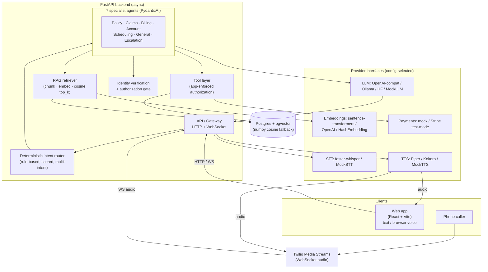

# System Architecture

This document describes the architecture of the multimodal AI insurance
customer-service platform. It is a synthetic demo: all customer records,
policies, and claims are fabricated for illustration.

## Overview

The platform serves two entry channels — a web app (text and browser voice)
and a phone channel (telephony audio) — through a single FastAPI backend. The
backend runs a deterministic intent router that dispatches to specialist
agents, which invoke authorized tools and a retrieval-augmented generation
(RAG) knowledge base. State and embeddings persist in Postgres with pgvector.
Speech-to-text (STT) and text-to-speech (TTS) providers sit behind interfaces
so the same core logic drives both channels.

## Request lifecycle

A voice turn flows: browser (or telephony) audio → voice activity detection →
STT emitting partial and final transcripts → intent router → specialist agent →
identity/authorization checks → tools and/or RAG → streaming LLM composition →
incremental per-sentence TTS → streaming audio back to the caller. Barge-in is
supported: user speech during TTS stops playback and reprocesses the turn. Text
requests take the same path without STT/TTS.

Crucially, **tool selection is deterministic and auditable**, while **tool
authorization and execution live in application code — never the LLM**. The LLM
only phrases already-verified facts, so it cannot hallucinate policy data or
invent coverage.

## Service boundaries

- **API / gateway** — FastAPI HTTP + WebSocket endpoints; session and channel
  handling.
- **Agents** — deterministic router plus seven PydanticAI specialists (Policy,
  Claims, Billing, Account, Scheduling, General, Escalation).
- **Tools** — the only path to mutate or read customer data; each call passes
  the authorization gate (verification + session-bound ownership).
- **RAG** — parses `knowledge/` markdown front-matter, paragraph-aware chunking
  (chunk_size 700, overlap 120), embeds, and retrieves top_k 4 above a minimum
  score with source attribution. Missing evidence yields an honest "I don't have
  enough info" and escalation, never invented coverage. Retrieved documents are
  treated as **untrusted** and sanitized against prompt injection; system, user,
  retrieved, and tool content are kept separate.
- **Providers** — LLM, STT, TTS, and embeddings behind interfaces, selected by
  config with mock defaults for local/test.
- **Persistence** — Postgres + pgvector in Docker; a numpy cosine fallback backs
  local and test runs. Embeddings are stored as JSON float arrays (pgvector
  column in production).
- **Speech** — faster-whisper for near-streaming STT; Piper (default) or Kokoro
  for streaming per-sentence TTS.
- **Telephony** — Twilio Media Streams over WebSocket, abstracted so core logic
  is provider-agnostic. Without Twilio credentials, web and browser voice still
  work fully.
- **Payments** — mock provider by default (amounts ending in `.99` simulate a
  decline) plus a Stripe test-mode adapter. No card data is stored.

## Why one backend + frontend + Postgres

The system is intentionally consolidated into a single FastAPI backend, one
React frontend, and one Postgres instance rather than a fleet of microservices.
This means fewer containers to build, run, and reason about; a single async
process where the router, agents, tools, and RAG share memory and types without
network hops; and one database for both relational state and vector search via
pgvector. For a demo (and a defensible production baseline) this is simpler to
operate and easier to audit, while provider interfaces preserve the option to
swap or externalize any component later.

## Async I/O

The backend is fully asynchronous (FastAPI + SQLAlchemy 2 async). Async I/O lets
a single process overlap the naturally latency-bound work of a voice turn —
STT streaming, provider/LLM calls, database queries, and TTS streaming — without
thread-per-request overhead, which keeps turn latency low and concurrency high.

## Observability

Every request and conversation carries an identifier propagated through
structured logs, so a turn can be traced end to end across router, specialist,
tools, RAG, and providers. Latency is tracked per stage — speech-end →
transcript, transcript → first token, first token → first audio, and speech-end
→ first audio — and surfaced in the admin view for tuning the voice pipeline.
