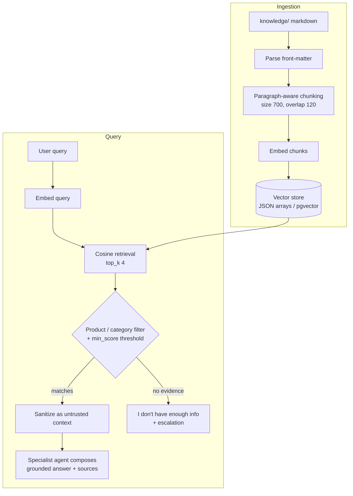

# RAG Design

Retrieval-Augmented Generation grounds every knowledge answer in the platform's
curated `knowledge/` corpus. The core principle: the LLM only phrases facts that
retrieval has already surfaced. When evidence is missing, the system says so and
escalates — it never invents coverage.

## Ingestion

Source content lives as markdown files under `knowledge/`. Ingestion runs in
stages:

1. **Parse front-matter.** Each document's YAML front-matter carries metadata —
   `product` (auto, homeowners, renters, life, health, commercial, umbrella),
   `category`, title, and source identifiers. This metadata is preserved on every
   chunk for filtering and attribution.
2. **Paragraph-aware chunking.** Body text is split on paragraph boundaries, then
   packed into chunks of **~700 characters** with **120 characters of overlap**.
   Paragraph awareness keeps semantically whole units together instead of cutting
   mid-sentence; the overlap preserves context that would otherwise be lost at a
   boundary.
3. **Embed.** Each chunk is turned into a vector by the configured embedding
   provider.
4. **Store.** Chunk text, metadata, and vector are persisted for retrieval.

## Embeddings

Embeddings sit behind the `EmbeddingProvider` interface and are selected by
config:

- **HashEmbedding** (default) — a deterministic lexical hashing vectorizer,
  dimension 256. No model download, reproducible across runs, ideal for local
  development and tests.
- **sentence-transformers** — dense semantic embeddings for higher retrieval
  quality on paraphrased queries.
- **OpenAI** — hosted embeddings when an API key is configured.

Because the interface is stable, switching providers changes only vector quality,
not pipeline shape.

## Vector Storage

Vectors are stored as **JSON float arrays** with a **numpy cosine-similarity
fallback** backend for local and test environments. In production, the same
vectors live in a **Postgres `pgvector`** column. Retrieval logic is identical
across both backends; only the similarity computation differs (in-process numpy
vs. database-side pgvector).

## Retrieval

A query is embedded with the same provider used at ingestion, then compared by
**cosine similarity**:

- **top_k = 4** — the four highest-scoring chunks are considered.
- **min_score threshold** — chunks below the threshold are discarded, so weak
  matches never reach the composer.
- **Product / category filtering** — front-matter metadata narrows the candidate
  set (e.g., an auto-policy question only searches auto content), improving
  precision and preventing cross-product leakage.

Surviving chunks are passed to the specialist agent as **untrusted context**:
they are sanitized against prompt injection and kept separate from system, user,
and tool content.

## Source Attribution & Grounding Guardrail

Every answer cites the documents it drew from, using the identifiers carried in
front-matter. This makes responses auditable and lets a user verify coverage.

The grounding guardrail is the heart of the design: **if no chunk clears the
min_score threshold, the system does not answer from the model's parametric
memory.** Instead it returns an honest "I don't have enough information" and
routes to escalation. No invented coverage, no hallucinated limits or exclusions.

## Pipeline

## Tradeoffs

**Chunk size.** Smaller chunks raise precision — retrieved text is tightly
scoped — but risk severing context a correct answer depends on. Larger chunks
carry more context but dilute the embedding, dragging in off-topic sentences that
lower similarity scores. The 700/120 setting is a middle ground for
paragraph-length policy prose; overlap buys back the context that hard boundaries
lose.

**top_k.** A higher `top_k` improves recall (more chance the right passage is
present) at the cost of precision and prompt budget — extra chunks add noise the
composer must ignore. `top_k = 4` keeps the context focused while covering
multi-part answers.

**min_score.** A high threshold favors honesty (fewer weak matches, more "I don't
know") over coverage; a low threshold does the reverse and risks weakly-grounded
answers. It is the primary dial for the precision/recall balance.

## Evaluation

Tune these parameters against a labeled question set drawn from the knowledge
corpus:

- **Retrieval quality** — recall@k (is the gold chunk in the top_k?) and
  precision@k across candidate chunk sizes and thresholds.
- **Grounding correctness** — on questions with *no* supporting document, confirm
  the system abstains and escalates rather than fabricating an answer. This
  false-answer rate is the metric the guardrail exists to protect.
- **Attribution accuracy** — cited sources actually contain the stated facts.
- **Threshold sweeps** — plot min_score against answer rate vs. false-answer rate
  to pick the operating point that maximizes coverage without sacrificing
  grounding.

Because HashEmbedding is deterministic, retrieval regressions are reproducible in
CI, and provider swaps can be A/B evaluated against the same fixtures.
