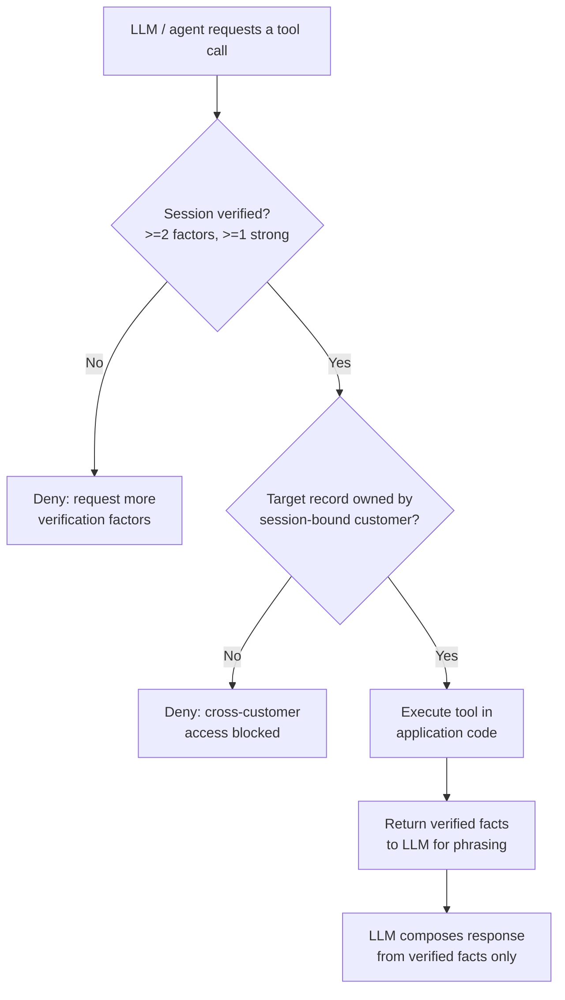

# Security & Privacy Design

This document describes how the platform protects customer data across identity
verification, tool authorization, retrieval, and logging. The design principle
throughout is simple: **security decisions are made in deterministic application
code, never delegated to the language model.** The LLM only phrases facts that
have already been verified and authorized.

> All customer records in this platform are **synthetic**. No real PII, no real
> company names, and no production customer data ever appear in the system,
> fixtures, logs, or documentation.

---

## Deterministic Identity Verification

Verification is a pure, rule-based function of the factors a caller supplies —
there is no model in the loop and no probabilistic scoring of identity.

A customer is considered verified only when **both** of these hold:

1. **At least two distinct factors** are provided, and
2. **At least one of them is a strong factor.**

| Strength | Factors |
|----------|-----------------------------------------------|
| Strong   | `policy_number`, `date_of_birth`, `otp_code`  |
| Weak     | `last_name`, `zip_code`                        |

Examples:

- `policy_number` + `zip_code` &rarr; verified (one strong, two total).
- `last_name` + `zip_code` &rarr; **rejected** (two weak, no strong factor).
- `otp_code` alone &rarr; **rejected** (only one factor).

The demo OTP is `123456`. Each factor is checked against the session-bound
customer record before it counts toward the threshold.

---

## Session Binding

When verification succeeds, the verified customer is **bound to the session**.
Every subsequent request in that session operates against that one customer
identity. A session can never be re-pointed at a different customer by anything
the caller (or the model) says. This is the foundation of cross-customer
prevention: the "who" is fixed at verification time and enforced server-side.

---

## Tool Authorization Gate

Specialist agents can *select* tools deterministically, but no tool executes
until it passes the authorization gate in application code. The gate enforces
two independent checks:

1. **Verification** — the session must satisfy the verification rules above for
   any tool that touches customer data.
2. **Ownership** — the target record (policy, claim, billing account) must
   belong to the session-bound customer.

Both checks run before any side effect. If either fails, the tool is not
executed and the agent returns a safe response (typically a request for more
verification factors, or an escalation).

### Decision Flow

---

## Why Security Is NOT in the LLM

Tool **selection** is deterministic and auditable (a rule-based, scored,
multi-intent router picks the specialist and tools). Tool **authorization and
execution** live entirely in application code. The LLM:

- never decides whether a caller is verified,
- never decides whether a record may be accessed,
- never executes a tool directly, and
- only receives facts that were already fetched and authorized.

Because the model only phrases pre-verified facts, it **cannot hallucinate
policy data** or talk itself past an authorization check. Prompt injection or a
jailbreak may change wording, but it cannot change what the application code
allows.

---

## Prompt-Injection Defense for RAG

Retrieved knowledge-base documents are treated as **untrusted input**. Markdown
in `knowledge/` is parsed, chunked, embedded, and retrieved by cosine
similarity — but the retrieved text may contain adversarial instructions, so it
is defended at two layers:

- **Sanitization** — retrieved chunks are sanitized against prompt-injection
  patterns before they reach the model.
- **Content separation** — system instructions, user input, retrieved
  documents, and tool results are kept in **separate, clearly delimited
  channels**. Retrieved content is never merged into the system prompt and is
  never allowed to act as an instruction.

Retrieval is grounded: answers cite their sources, and when evidence is missing
the assistant says so honestly ("I don't have enough info") and escalates,
rather than inventing coverage.

---

## Secrets Handling

- All credentials (LLM/STT/TTS provider keys, Twilio, Stripe test keys) are read
  from environment variables via a local `.env` file.
- `.env` is **never committed**; only a documented example template is tracked.
- With no provider credentials configured, the system falls back to mock
  providers, so the platform runs fully offline for local and test use.

---

## PII Masking in Logs & Admin

- Sensitive fields (policy numbers, dates of birth, OTP codes, contact details)
  are **masked** in logs and in the admin view.
- The admin surface shows operational data — intent routing, per-stage latency,
  retrieval sources — without exposing raw sensitive identifiers.
- No payment card data is ever stored; payments use a mock provider by default
  and a Stripe test-mode adapter otherwise.

---

## Synthetic Data Only

Every customer, policy, claim, and billing record is fabricated for
demonstration. There is no path by which real customer data enters the system.
This makes the platform safe to run, share, and inspect end-to-end while still
exercising the full security model.
