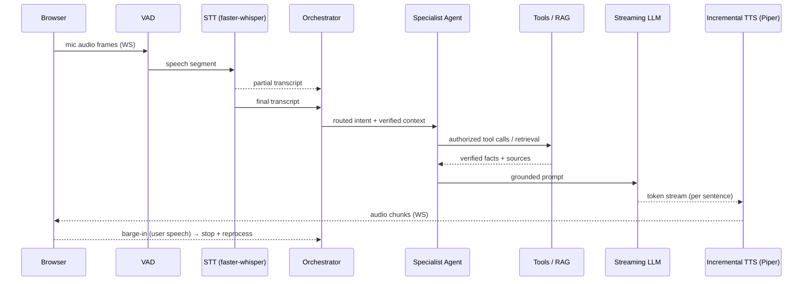

# Voice Pipeline

The voice pipeline turns a caller's speech into a grounded, spoken answer with the lowest practical latency. It is a fully streaming path: audio, transcripts, tokens, and synthesized audio all flow incrementally rather than in discrete request/response batches. Every provider sits behind an interface, so the same orchestration runs identically with mock providers (local/test) or real models.

## Streaming Architecture

The stages, in order:

1. **Browser audio** — mic frames are captured and streamed over a WebSocket.
2. **VAD** — voice-activity detection segments speech and marks speech-end.
3. **STT (partial/final)** — partial transcripts stream as the caller talks; a final transcript is emitted at speech-end.
4. **Orchestrator** — the deterministic, rule-based, scored multi-intent router selects the intent and hands off verified session context. Tool *selection* is deterministic and auditable.
5. **Specialist** — one of seven agents (Policy, Claims, Billing, Account, Scheduling, General, Escalation) handles the turn.
6. **Tools / RAG** — tool *authorization* and execution are enforced in application code (verification + ownership gate), never by the LLM. RAG retrieves top_k 4 chunks above the min-score threshold with source attribution.
7. **Streaming LLM** — the LLM only phrases already-verified facts, so it cannot invent policy data. Tokens stream out.
8. **Incremental TTS** — synthesis runs per sentence as tokens arrive.
9. **Streaming audio** — audio chunks stream back to the browser and play as they land.

## Barge-in and Interruption

If the caller speaks while TTS is playing, VAD detects the new speech, playback stops immediately, and the turn is reprocessed with the new input. This keeps the conversation natural and prevents the assistant from talking over the user. Barge-in is handled at the pipeline boundary so it works regardless of which STT/TTS providers are active.

## STT and TTS Choices

**STT — faster-whisper (Whisper family).** Chosen for streaming / near-streaming behavior with partial transcripts, CPU and GPU support, and configurable model size. This lets us trade accuracy for latency per hardware profile without changing the pipeline.

**TTS — Piper (default), Kokoro (optional).** Piper is fast on CPU, carries a permissive license, and streams per sentence, which pairs naturally with the incremental token stream. Kokoro is available as an optional higher-quality voice when the hardware profile allows.

## Mock Providers for Local Dev

Local and test runs default to deterministic mocks so the full pipeline works with no model downloads:

- **MockSTT** recovers text from an audio envelope rather than performing real transcription.
- **MockTTS** emits a placeholder WAV (a short tone) instead of synthesized speech.

Because everything is behind provider interfaces, swapping to faster-whisper and Piper is a config change, not a code change.

## Latency Metrics

Latency is tracked per stage and surfaced in the admin view:

- speech-end → transcript
- transcript → first token
- first token → first audio
- speech-end → first audio (end-to-end perceived latency)

These metrics make regressions visible and let us tune model size, chunking, and hardware profile against real numbers.

## WebSocket Protocol Overview

A single WebSocket carries the bidirectional audio and event stream:

- **Client → server:** mic audio frames, plus control/barge-in signals.
- **Server → client:** partial transcripts, final transcripts, streamed answer tokens/text, streamed TTS audio chunks, and per-stage latency events.

Interleaving transcripts, tokens, and audio on one channel keeps the UI in sync with what the caller hears.

## Graceful Degradation

The pipeline degrades without breaking. If TTS is unavailable, the assistant still answers in text and the UI reports that voice output is unavailable — the conversation continues rather than failing. The same principle applies across the stack: with no Twilio credentials, web plus browser voice still work fully; when RAG lacks evidence, the assistant returns an honest "I don't have enough info" and escalates instead of inventing coverage.

All records referenced by this pipeline are synthetic demo data.
